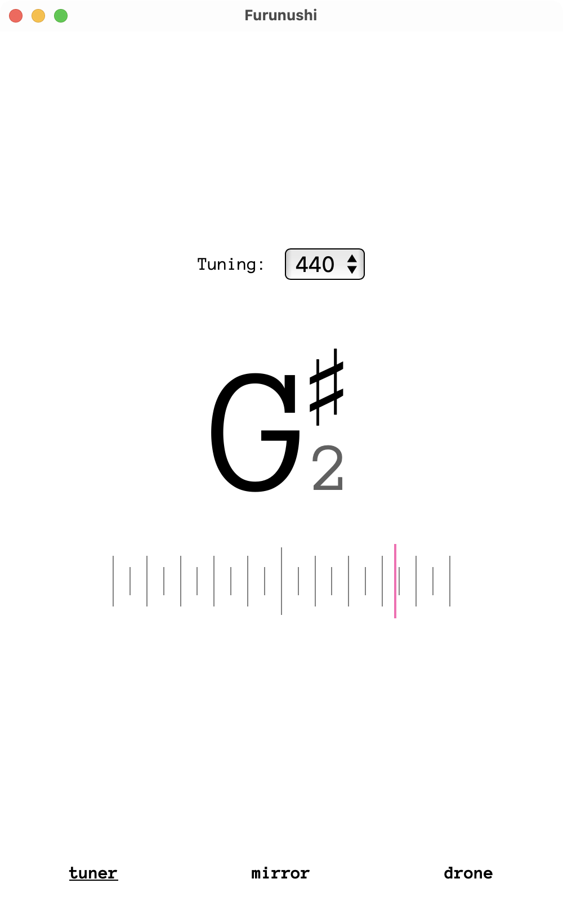
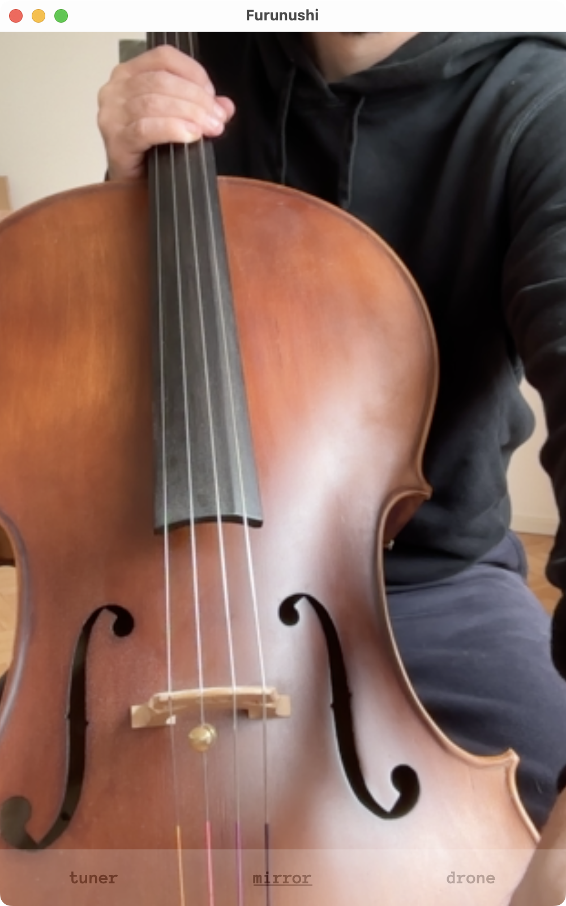
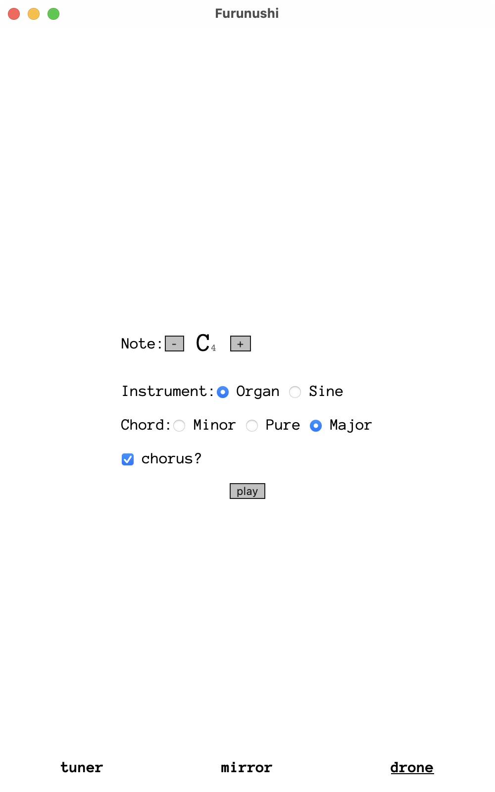

# Furunushi

**Furunushi** is a lightweight, cross-platform all-in-one app for musicians built with [Tauri](https://v2.tauri.app/). Beyond its core tuning functionality, it includes extra features like a mirror and a drone tone generator. This project is under active development and open to community contributions!

## Features

- **Tuner**: Precise instrument tuning with real-time audio analysis.
- **Mirror**: A simple camera display to check your appearance during practice.
- **Drone Tone**: Generate a sustained tone for practice or ear-based tuning.
- Lightweight and fast interface powered by Tauri (Rust + Webview).

### Screenshots

|               Tuner                |               Mirror                |               Drone                |
| :--------------------------------: | :---------------------------------: | :--------------------------------: |
|  |  |  |

## Installation

Get the latest build from the [Releases](https://github.com/fullpipe/furunushi/releases) section.

### Instructions

- Go to the [Releases](https://github.com/fullpipe/furunushi/releases) section.
- Download the
  - `.dmg` for macOS
  - `.msi`/`setup.exe` for Windows.

> **Note**: Linux version is in development.

## development

To build the project yourself:

### Prerequisites

- [Rust](https://www.rust-lang.org/) (stable version)
- [Node.js](https://nodejs.org/) (LTS recommended)
- [Tauri CLI](https://v2.tauri.app/)

### Steps

Clone the repository:

```bash
git clone git@github.com:fullpipe/furunushi.git
cd furunushi
```

Install dependencies:

```bash
npm install
```

For Desktop development, run:

```sh
npm run tauri dev
```

For iOS development, run:

```sh
npm run tauri ios dev
```

Generate icons

```sh
cargo tauri icon src-tauri/icons/raw.png
```

## Contributing

At the moment rules are not strict. Welcome!

1. Fork the repository.
2. Create a new branch (`git checkout -b feature/your-idea`).
3. Make your changes and commit them (`git commit -m "Added XYZ feature"`).
4. Push to your fork (`git push origin feature/your-idea`).
5. Open a Pull Request.

## Roadmap

- [x] Windows
- [ ] Linux support
- [ ] App store release
- [ ] UI/UX improvements, designers are welcome!
- [ ] Metronome
- [ ] different pitch detections
  - https://github.com/jkjaer/fastF0Nls
  - https://www.mdpi.com/2076-3417/13/14/8191
  - https://github.com/JorenSix/TarsosDSP/tree/master/core/src/main/java/be/tarsos/dsp/pitch
- [ ] Pitch games
- [ ] Localization into other languages?
- [ ] Handle catch(console.error)

## License

This project is licensed under the [AGPL-3.0](LICENSE).

## Contact

For questions or suggestions, create an [Issue](https://github.com/fullpipe/furunushi/issues) or start a [discussion](https://github.com/fullpipe/furunushi/discussions).
